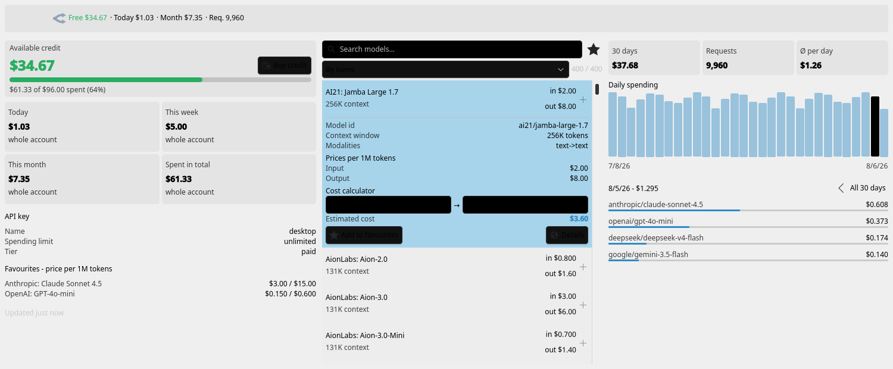
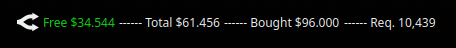
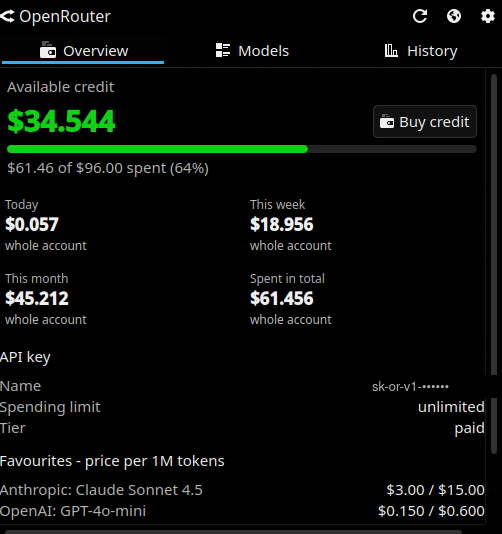
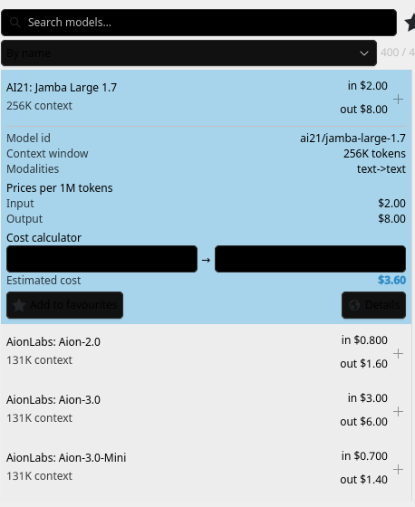
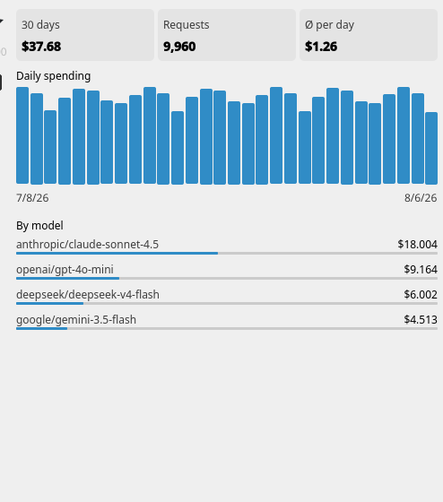
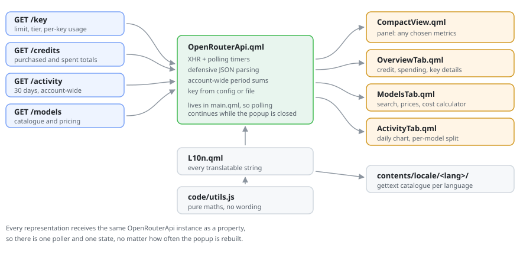

<div align="center">


# OpenRouter Monitor

**Your OpenRouter credit, spending and model pricing — right in the Plasma panel.**

[](https://kde.org/plasma-desktop/)
[](LICENSE)
[](translate/po)

</div>



<sub>Screenshots are rendered by `tools/qml-bench.py` with synthetic account data, so no
real balance is shown. Replace the files in `docs/` with your own if you prefer.</sub>

---

## What it does

### In the panel — pick as many metrics as you like



The bar is **multiple choice**. Tick any combination and they line up next to each other:

| Metric | Source | Notes |
|---|---|---|
| Available credit | `/credits` | coloured green / amber / red by your thresholds |
| Remaining key limit | `/key` | only if the key has a spending cap |
| Spent today / this week / this month | `/activity`, falling back to `/key` | account-wide where possible |
| Spent in total | `/credits` | |
| Credit purchased | `/credits` | |
| Requests (30 days) | `/activity` | |

Plus: the official OpenRouter mark tinted to your theme colour, optional short captions,
a free separator, side-by-side or stacked, and automatic stacking in vertical panels.
Middle-click refreshes; the tooltip carries a summary.

### Interface language

A drop-down in **Settings → Appearance** switches the widget's language independently of
the rest of Plasma, and it applies immediately without a restart. Leave it on *System
language* to follow the desktop locale; English needs no catalogue because the source
strings already are English.

### In the popup — three tabs

<table>
<tr>
<td width="33%" valign="top"></td>
<td width="33%" valign="top"></td>
<td width="33%" valign="top"></td>
</tr>
<tr>
<td valign="top"><b>Overview</b><br>Credit card with a spend bar, four period tiles that
state whether the figure is account-wide or key-scoped, key details (limit, remaining,
reset, tier, BYOK), favourite model prices, and a top-up button.</td>
<td valign="top"><b>Models</b><br>All ~400 models, searchable and sortable by name,
cheapest input/output, largest context or newest. Expand one for the full price table
(input, output, cache read/write, reasoning, image, request, web search), a
<b>cost calculator</b>, and a favourite star.</td>
<td valign="top"><b>History</b><br>Daily spending for the last 30 days as a bar chart
with per-day tooltips, totals and average per day. <b>Click a bar</b> to drill into that
single day; the breakdown below then lists only the models used that day.</td>
</tr>
</table>

### Elsewhere

- Notification when credit drops below your warning threshold, with a one-click top-up action
- Context menu shortcuts to openrouter.ai activity and billing
- Nothing is placed automatically: the widget only appears where you add it

---

## Install

```bash
git clone https://github.com/teodorgross/openrouter-plasmoid.git
cd openrouter-plasmoid
./install.sh
systemctl --user restart plasma-plasmashell.service
```

Then right-click the panel → **Add Widgets** → **OpenRouter Monitor**.

`install.sh` compiles the translation catalogues, installs the icon into your
icon theme and registers the package with `kpackagetool6`. To remove everything
again, run `./uninstall.sh`.

> Plasma keeps QML in memory. **After every change to the sources you must restart
> plasmashell**, otherwise you keep looking at the previously loaded version.

**Requirements:** Plasma 6, KF6. `python3` for the translation build (standard
library only, no gettext needed). `python3-pyside6` only if you want to run the
QML bench.

---

## Set up your keys

Right-click the widget → **Configure OpenRouter Monitor** → **Account**.

- **API key** — your normal inference key (`sk-or-v1-…`) from
  [openrouter.ai/keys](https://openrouter.ai/keys). Powers `/key`: limit, remaining, tier.
- **Management key** — optional, from
  [openrouter.ai/settings/provisioning-keys](https://openrouter.ai/settings/provisioning-keys).
  Officially required for `/credits` (balance) and `/activity` (history), though many
  accounts serve both for a plain key. The widget tries the management key first and
  falls back to the API key.

**Test connection** verifies the key without leaving the dialog.

### Keep keys out of plaintext

A key typed into the dialog is stored unencrypted in
`~/.config/plasma-org.kde.plasma.desktop-appletsrc`. Better:

```bash
mkdir -p ~/.config/openrouter
printf '%s\n' 'sk-or-v1-…' > ~/.config/openrouter/apikey
chmod 600 ~/.config/openrouter/apikey
```

and point the dialog at the path under *…or from a file*. The file wins over the typed
key; lines starting with `#` are ignored.

---

## How "spent today" is worked out

Three sources, none of which is sufficient alone:

| Source | Covers | Problem |
|---|---|---|
| `/key` | one key | reports zero if you use several keys |
| `/activity` | whole account | **stops at the last completed UTC day** — today is missing |
| `/credits` | whole account, live | only a running total, not per day |

So the widget combines them. Week and month come from `/activity`. **Today** is derived
from `/credits`: on the first poll of each UTC day it remembers `total_usage`, and
today's spending is the difference since then. Every tile states whether its number
covers the whole account or just the configured key.

One consequence worth knowing: spending that happened earlier today, before the widget's
first poll of that day, cannot be recovered — no endpoint exposes it. Today's figure
therefore starts counting from the moment the widget first sees the new day.

---

## Languages

The interface ships in **12 languages**, picked automatically from your Plasma locale:

English · Deutsch · Español · Français · Italiano · Nederlands · Polski ·
Português (BR) · Русский · Türkçe · 中文（简体） · 日本語

Numbers follow your locale too — `$1,234.56` or `$1.234,56` as appropriate.

Language selection lives in the widget, not in the desktop: `KLocalizedString` always
follows the Plasma locale, so the translations are also compiled into
`contents/code/catalogs.js`, which `L10n.qml` imports statically and consults first.
(Statically, because Qt refuses `XMLHttpRequest` on local files inside plasmashell.)

### Adding or fixing a translation

The toolchain is pure Python, no gettext required:

```bash
translate/i18n.py extract          # rebuild template.pot from the QML sources
cp translate/template.pot translate/po/sv.po   # start a new language
translate/i18n.py merge            # pull new strings into every existing .po
translate/i18n.py build            # compile .po -> package/contents/locale/
translate/i18n.py stats            # coverage per language
```

Fill in the `msgstr` lines, run `build`, reinstall, restart plasmashell.
Plural forms are supported, including languages with three forms.

---

## How it is built



```
package/
├── metadata.json                  plasmoid manifest (translated name/description)
└── contents/
    ├── config/main.xml            configuration schema
    ├── config/config.qml          settings dialog pages
    ├── code/utils.js              pure maths and formatting, no wording
    ├── icons/openrouter.svg       official mark (simple-icons, CC0)
    ├── locale/<lang>/…            compiled catalogues (generated)
    └── ui/
        ├── main.qml               root: tooltip, notification, context menu
        ├── OpenRouterApi.qml      all HTTP calls and derived state
        ├── L10n.qml               every translatable string and helper
        ├── CompactView.qml        panel representation
        ├── FullView.qml           popup with heading and tabs
        ├── OverviewTab.qml  ModelsTab.qml  ActivityTab.qml
        ├── StatTile.qml  InfoRow.qml  MeterBar.qml
        └── Config*.qml            settings pages
translate/    i18n.py + template.pot + po/<lang>.po
tools/        qml-bench.py + TestMain.qml + Plasmoid.qml (test harness)
```

Three decisions worth knowing:

- **One data object.** `OpenRouterApi` is created once in `main.qml` and passed to both
  representations as a property. The popup is destroyed whenever it closes, so keeping
  state there would restart polling on every open.
- **No words in `utils.js`.** It is a `.pragma library` and therefore has no QML context
  and no `i18n()`. Anything a user reads lives in `L10n.qml`.
- **No local file reads via XHR.** Qt blocks them inside plasmashell, silently. Key files
  are read through a short-lived process via `Plasma5Support.DataSource`, and translation
  catalogues are a statically imported JS module rather than data loaded at runtime.

---

## Development

```bash
tools/qml-bench.py --shot /tmp/bench.png
```

Loads the widget outside plasmashell with a stubbed `Plasmoid` object and synthetic
account data, prints every QML warning to stderr, and renders a PNG.

This exists because `plasmawindowed` proved useless here: Qt logs to journald when
stderr is not a TTY, so even a deliberately broken binding produced complete silence.
The bench caught two real layout bugs that would otherwise have shipped.

Plasma's own QML messages go to the journal:

```bash
journalctl --user -f -t plasmashell
```

### Checking the API against your account

```bash
./diagnose.sh
```

Queries all four endpoints with the keys stored in the widget and prints status codes
and returned fields — without printing the keys.

---

## Licence

MIT — see [LICENSE](LICENSE). The OpenRouter mark is from
[simple-icons](https://simpleicons.org) (CC0) and is used only to identify the service.
This project is not affiliated with OpenRouter.
